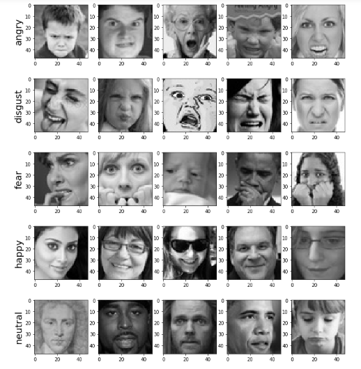
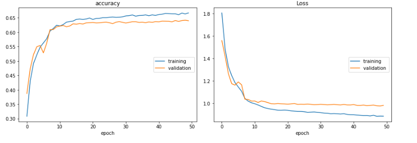

# Facial-Expression-Recognition
Build and train CNN in Keras from scratch to recognize facial expression

## Model

## Dataset 

it contain seven classes

["Angry", "Disgust", "Fear", "Happy", "Neutral", "Sad", "Surprise"]

## Dataset Samples    

## Training

1. Compile the main.py file, it will create link of webpage(i.e localhost)
2. Copy url and paste it on browser

And Done, a real time facial expression is ON

## Training Outputs

